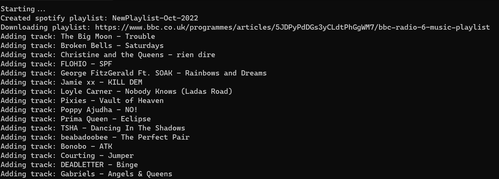

# To use the app

## Step 1 - Configure

The configuration file is appsettings.json

|Setting|Description|
|-------|-----------|
|SpotifyApiToken|Create youself a token here https://developer.spotify.com/|
|SpotifyUsername|Spotify username, regular or email|
|WebPlaylistUrls|E.G. https://www.bbc.co.uk/programmes/articles/5JDPyPdDGs3yCLdtPhGgWM7/bbc-radio-6-music-playlist|

## Step 2 - Run

Run WebPlaylistToSpotify.exe

