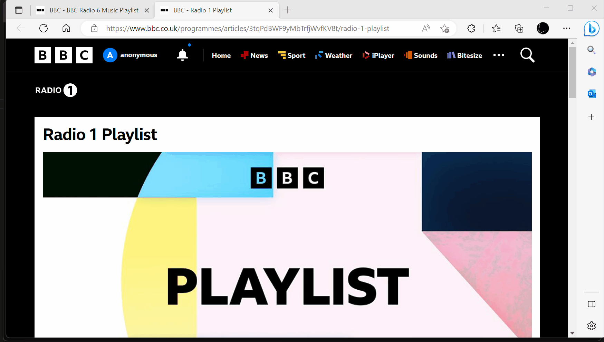

[](https://github.com/shortall/WebPlaylistToSpotify/actions/workflows/version-and-release.yml) [](https://github.com/shortall/WebPlaylistToSpotify/actions/workflows/auto-package-update.yml)

# About

This app will let you create a single Spotify playlist based on tracks listed in one or more web pages. You will need to come up with an XPath expression that will extract the track names from the web page.



Useful links:

[W3Schools XPath](https://www.w3schools.com/xml/xpath_intro.asp)

[VSCode XPath Tester Extension](https://marketplace.visualstudio.com/items?itemName=creinbacher.xpathtester)

# To use the app

## Step 1 - Create a Spotify app

* Go to https://developer.spotify.com/dashboard/applications
* Create an application and make a note of the Client ID
* Add a redirect URI of `http://127.0.0.1/` (This is so when you authorise via your browser it will pass the access token back to the app)

## Step 2 - Configure

The configuration file is appsettings.json

### An example configuration

```json5
{
    "SpotifyUsername": "WhateverMySpotifyUsernameIs",      // Your Spotify username or email
    "SpotifyClientId": "00000000000000000000000000000000", // The client ID of the application you created in your Spotify developer dashboard
    "WebPlaylistConfig": {
        "Name": "BbcRadio6&1",                             // This will be used in the naming of the new Spotify playlist
        "Playlists": [                                     // In this example we will import tracks from 2 playlists
            {
                "Url": "https://www.bbc.co.uk/programmes/articles/5JDPyPdDGs3yCLdtPhGgWM7/bbc-radio-6-music-playlist",                       // URL of the first playlist 
                "TrackNamesXPath": "(//div[@class='text--prose']/p)/descendant-or-self::*[contains(text(),'-')]/text()[normalize-space()]"   // XPath to extract track names
            },
            {
                "Url": "https://www.bbc.co.uk/programmes/articles/3tqPdBWF9yMbTrfjWvfKV8t/radio-1-playlist",                                 // URL of the second playlist 
                "TrackNamesXPath": "(//div[@class='text--prose']/p)/descendant-or-self::*[contains(text(),'-')]/text()[normalize-space()]"   // XPath to extract track names
            }
        ]
    }
}
```

## Step 3 - Run

Run WebPlaylistToSpotify.exe

# To contribute to the app

This repo is setup to use [verisonise](https://github.com/versionize/versionize). To bump the version automatically format your commit message accordingly.

# Point of interest

In terms of the code the part of this that might be useful reference for others is the example of the Spotify auth flow with PKCE from the command line